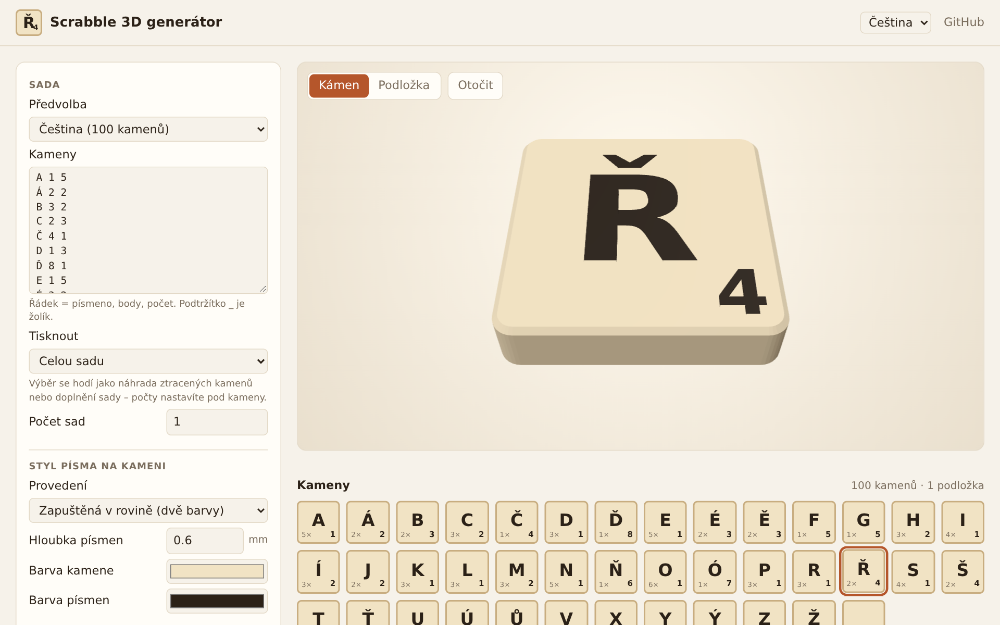
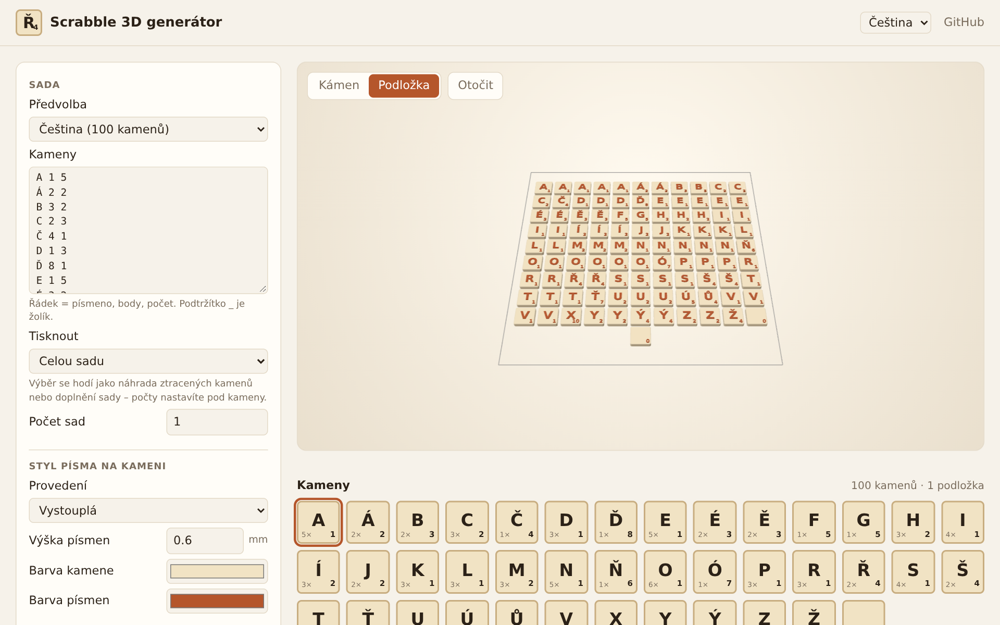
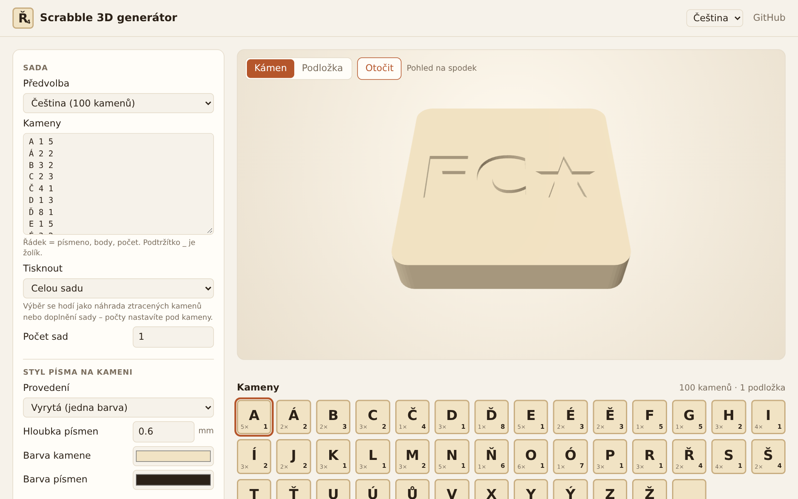
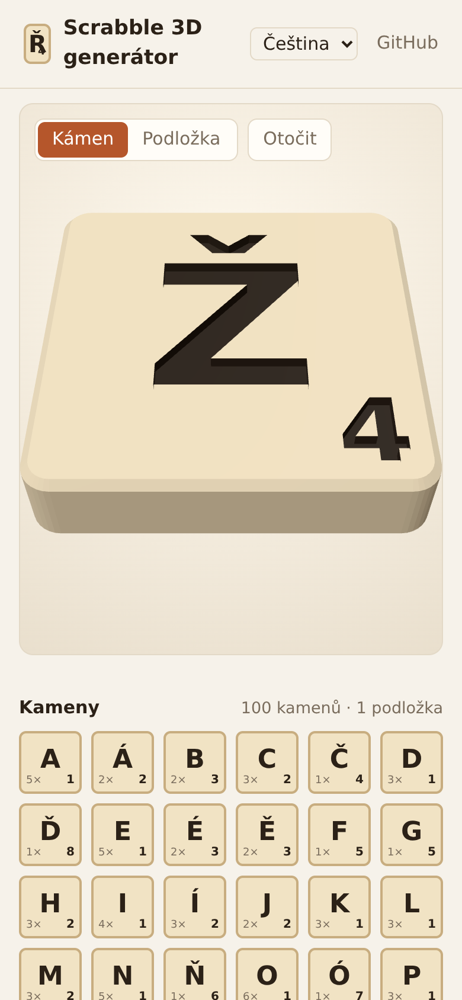
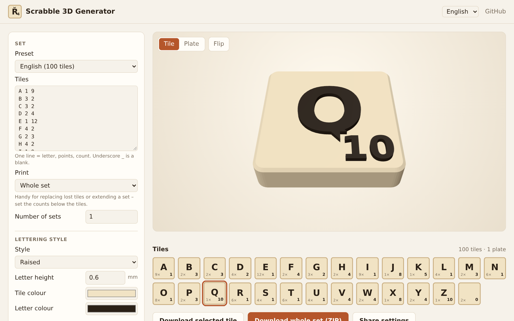

# Scrabble 3D generátor

🇬🇧 [English below](#english)

Mini webová aplikace (česky i anglicky), která generuje kameny do hry Scrabble jako 3D modely pro tisk na 3D tiskárně.
Vše běží přímo v prohlížeči, žádný server ani instalace nejsou potřeba.

**👉 https://filipchalupa.cz/scrabble-3d-generator/**



| Celá sada na podložce                                | Spodek se značkou                                                     | Mobil                                            |
| ---------------------------------------------------- | --------------------------------------------------------------------- | ------------------------------------------------ |
|  |  |  |

Screenshoty se generují příkazem `npm run screenshots`.

## Co umí

- předvolby rozložení písmen pro **češtinu**, **slovenštinu**, **němčinu**, **polštinu** a **angličtinu** (podle [Wikipedie](https://en.wikipedia.org/wiki/Scrabble_letter_distributions)), nebo vlastní seznam (`písmeno body počet`, `_` = žolík)
- tři provedení písmen:
  - **vyrytá** – jedna barva, písmena jsou prohlubně v kameni
  - **zapuštěná v rovině** – dvoubarevný tisk (AMS / MMU), povrch kamene je hladký
  - **vystouplá** – písmena vystupují nad povrch
- nastavitelné rozměry kamene, zaoblení rohů, zkosení horní hrany, velikost a posun písmene i bodové hodnoty
- volitelná nula na žolíku, aby byl poznat vršek kamene
- značka vyrytá na spodku kamene (iniciály, symbol) pro odlišení sad
- tipy pro slicer: kam vložit výměnu filamentu, žehlení, kontrola násobků výšky vrstvy
- přibalené fonty s diakritikou (DejaVu, Liberation) nebo vlastní TTF/OTF/WOFF (zapamatuje se)
- upozornění na znaky, které font neobsahuje, a na písmena přesahující okraj kamene
- sdílení nastavení odkazem (tlačítko „Sdílet nastavení“)
- tisk celé sady (i víc sad najednou), nebo jen vybraných kamenů – náhrada ztracených či doplnění sady
- rozmístění kamenů na podložky podle tiskárny (Bambu Lab, Prusa, Creality, vlastní rozměr)
- volitelný tisk lícem dolů (hladký líc z texturované / hladké podložky), náhled jde otočit a ukázat spodek
- export:
  - jednotlivý kámen nebo celá sada v ZIPu
  - `STL` (jeden uzavřený díl) a `3MF` s každým kamenem jako samostatným objektem a barevnými díly

## Instalace (PWA)

Web jde nainstalovat jako aplikace (Chrome / Edge: ikona v adresním řádku, Android: „Přidat na plochu“).
Název aplikace je podle jazyka systému česky nebo anglicky (Chrome a Edge 148+).
Funguje jen online – bez připojení se zobrazí omluvná stránka.

## Vícebarevný tisk

V souboru `3MF` je každý kámen samostatný objekt (stejné kameny jsou instancemi jednoho objektu),
složený ze dílů _Kámen_ a _Písmena_. Po otevření v PrusaSliceru, Bambu Studiu nebo OrcaSliceru stačí dílům
přiřadit filamenty; jednotlivé kameny jde mazat nebo přesouvat.
Alternativně lze načíst `*-kamen.stl` a `*-pismena.stl` současně a potvrdit načtení jako jeden objekt s více díly.

### Na jednobarevné tiskárně

Použijte provedení **vystouplá**: kámen se tiskne do své tloušťky (výchozí 4 mm) a nad ní už jsou jen písmena.
Ve sliceru přidejte výměnu filamentu ve výšce první vrstvy nad tloušťkou kamene
(PrusaSlicer: „+“ u posuvníku vrstev, Bambu/Orca: pravým tlačítkem „Add pause / filament change“).

Provedení **zapuštěná v rovině** jednobarevně vytisknout nejde – písmena i kámen sdílejí stejné vrstvy,
takže výměna filamentu by obarvila celý povrch. Provedení **vyrytá** je jednobarevné, prohlubně lze případně zatřít barvou.

Hloubku / výšku písmen volte jako násobek výšky vrstvy (např. 0,6 mm = 3 × 0,2 mm).

## Vývoj

Statická stránka bez build kroku. Pro vývoj stačí Node 22:

```sh
npm install
npm start            # http://localhost:8000/
npm test             # unit testy: geometrie (uzavřenost sítí), nastavení, rozmístění, tipy
npm run test:e2e     # testy v prohlížeči (Playwright)
npm run lint         # ESLint + Prettier
npm run screenshots  # obnoví screenshoty v docs/
```

Knihovny ([three.js](https://threejs.org/), [opentype.js](https://opentype.js.org/), [polygon-clipping](https://github.com/mfogel/polygon-clipping), [earcut](https://github.com/mapbox/earcut), [fflate](https://github.com/101arrowz/fflate)) se v prohlížeči načítají z CDN (`src/deps.js`, three.js přes import map); npm balíčky slouží jen testům.

| Soubor                                  | Obsah                                                             |
| --------------------------------------- | ----------------------------------------------------------------- |
| `src/main.js`                           | propojení aplikace: stav, seznam kamenů, export, jazyk            |
| `src/settings.js`                       | popis formuláře, výchozí hodnoty, uložení, sdílení odkazem        |
| `src/tiles.js`                          | kameny k tisku a jejich rozmístění na podložky                    |
| `src/tips.js`                           | tipy pro tisk a upozornění                                        |
| `src/form.js`                           | formulář nastavení                                                |
| `src/preview.js`                        | 3D náhled (three.js)                                              |
| `src/worker.js`, `src/worker-client.js` | Web Worker, který staví kameny a exportuje mimo hlavní vlákno     |
| `src/geometry.js`                       | převod glyfů na obrysy, sjednocení a vytažení do uzavřené 3D sítě |
| `src/export.js`                         | zápis binárního STL a 3MF                                         |
| `src/presets.js`                        | rozložení písmen, fonty, tiskárny                                 |
| `src/i18n.js`                           | překlady rozhraní (čeština, angličtina)                           |

## Licence

Kód: MIT. Fonty ve složce `fonts/` mají vlastní licence (DejaVu – Bitstream Vera / public domain, Liberation – SIL OFL 1.1), viz soubory `fonts/LICENSE-*.txt`.

---

## English

A small web app that generates **Scrabble tiles as 3D models** for 3D printing – right in your browser, nothing to install.

**👉 https://filipchalupa.cz/scrabble-3d-generator/** (the interface switches to English automatically)



- Letter distributions for English, Czech, Slovak, German and Polish, or your own list (`letter points count`, `_` = blank).
- Three lettering styles: **engraved** (one colour), **flush inlay** (two colours, needs AMS / MMU) and **raised**
  (two colours even on a single-extruder printer – just add a filament change at the layer the tips tell you).
- Adjustable tile size, corner radius, top-edge chamfer, letter and point value placement, an optional mark on the bottom.
- Tiles are laid out on plates for your printer; print a whole set, several sets, or only selected tiles to replace lost ones.
- Exports `STL` and `3MF`. In the 3MF every tile is its own object made of a _Tile_ and a _Letters_ part,
  so you can assign filaments and move or delete single tiles in PrusaSlicer, Bambu Studio or OrcaSlicer.
- Share your settings with a link, install it as a PWA.

Development: `npm install`, then `npm start`, `npm test`, `npm run test:e2e`, `npm run lint`.

Code is MIT licensed; bundled fonts keep their own licences (see `fonts/`).
