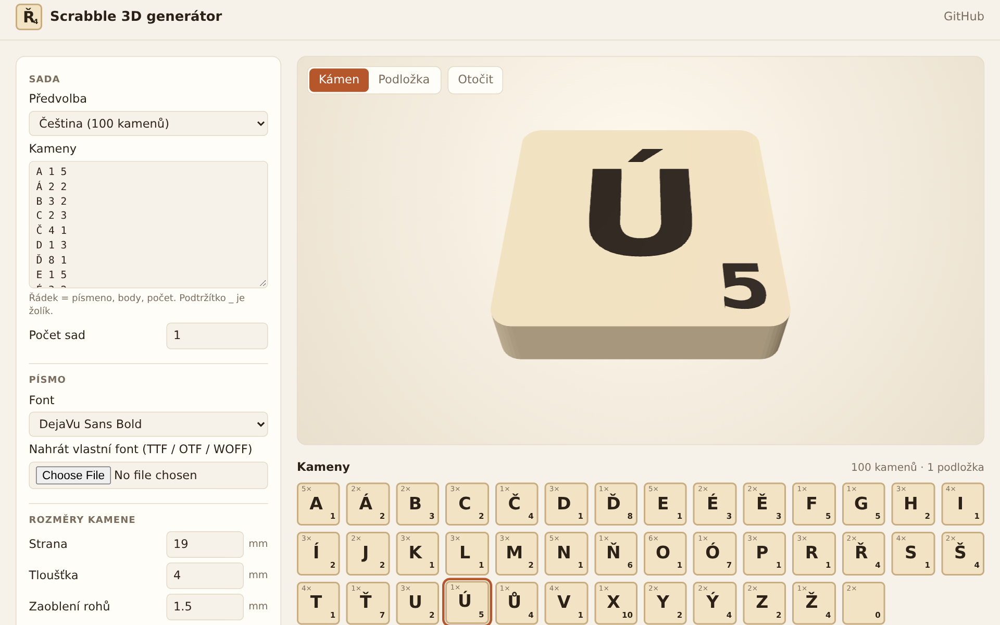

# Scrabble 3D generátor

Mini webová aplikace (česky i anglicky), která generuje kameny do hry Scrabble jako 3D modely pro tisk na 3D tiskárně.
Vše běží přímo v prohlížeči, žádný server ani instalace nejsou potřeba.

**👉 https://filipchalupa.cz/scrabble-3d-generator/**



## Co umí

- předvolby rozložení písmen pro **češtinu**, **slovenštinu**, **němčinu**, **polštinu** a **angličtinu** (podle [Wikipedie](https://en.wikipedia.org/wiki/Scrabble_letter_distributions)), nebo vlastní seznam (`písmeno body počet`, `_` = žolík)
- tři provedení písmen:
  - **vyrytá** – jedna barva, písmena jsou prohlubně v kameni
  - **zapuštěná v rovině** – dvoubarevný tisk (AMS / MMU), povrch kamene je hladký
  - **vystouplá** – písmena vystupují nad povrch
- nastavitelné rozměry kamene, zaoblení rohů, zkosení horní hrany, velikost a posun písmene i bodové hodnoty
- volitelná nula na žolíku, aby byl poznat vršek kamene
- značka vyrytá na spodku kamene (iniciály, symbol) pro odlišení sad
- tipy pro slicer: kam vložit výměnu filamentu, žehlení, kontrola násobků výšky vrstvy
- přibalené fonty s diakritikou (DejaVu, Liberation) nebo vlastní TTF/OTF/WOFF (zapamatuje se)
- upozornění na znaky, které font neobsahuje, a na písmena přesahující okraj kamene
- sdílení nastavení odkazem (tlačítko „Sdílet nastavení“)
- tisk celé sady (i víc sad najednou), nebo jen vybraných kamenů – náhrada ztracených či doplnění sady
- rozmístění kamenů na podložky podle tiskárny (Bambu Lab, Prusa, Creality, vlastní rozměr)
- volitelný tisk lícem dolů (hladký líc z texturované / hladké podložky), náhled jde otočit a ukázat spodek
- export:
  - jednotlivý kámen nebo celá sada v ZIPu
  - `STL` (jeden uzavřený díl) a `3MF` s každým kamenem jako samostatným objektem a barevnými díly

## Instalace (PWA)

Web jde nainstalovat jako aplikace (Chrome / Edge: ikona v adresním řádku, Android: „Přidat na plochu“).
Funguje jen online – bez připojení se zobrazí omluvná stránka.

## Vícebarevný tisk

V souboru `3MF` je každý kámen samostatný objekt (stejné kameny jsou instancemi jednoho objektu),
složený ze dílů *Kámen* a *Písmena*. Po otevření v PrusaSliceru, Bambu Studiu nebo OrcaSliceru stačí dílům
přiřadit filamenty; jednotlivé kameny jde mazat nebo přesouvat.
Alternativně lze načíst `*-kamen.stl` a `*-pismena.stl` současně a potvrdit načtení jako jeden objekt s více díly.

### Na jednobarevné tiskárně

Použijte provedení **vystouplá**: kámen se tiskne do své tloušťky (výchozí 4 mm) a nad ní už jsou jen písmena.
Ve sliceru přidejte výměnu filamentu ve výšce první vrstvy nad tloušťkou kamene
(PrusaSlicer: „+“ u posuvníku vrstev, Bambu/Orca: pravým tlačítkem „Add pause / filament change“).

Provedení **zapuštěná v rovině** jednobarevně vytisknout nejde – písmena i kámen sdílejí stejné vrstvy,
takže výměna filamentu by obarvila celý povrch. Provedení **vyrytá** je jednobarevné, prohlubně lze případně zatřít barvou.

Hloubku / výšku písmen volte jako násobek výšky vrstvy (např. 0,6 mm = 3 × 0,2 mm).

## Vývoj

Statická stránka bez build kroku – stačí ji servírovat libovolným HTTP serverem:

```sh
python3 -m http.server
```

Testy (uzavřenost sítí pro všechny předvolby, styly a fonty, formát STL/3MF) běží v Node:

```sh
npm install
npm test
```

Knihovny ([three.js](https://threejs.org/), [opentype.js](https://opentype.js.org/), [polygon-clipping](https://github.com/mfogel/polygon-clipping), [earcut](https://github.com/mapbox/earcut), [fflate](https://github.com/101arrowz/fflate)) se načítají z CDN (`src/deps.js`, three.js přes import map).

- `src/geometry.js` – převod glyfů na obrysy, sjednocení a vytažení do uzavřené 3D sítě
- `src/export.js` – zápis binárního STL a 3MF
- `src/presets.js` – rozložení písmen, fonty, tiskárny
- `src/i18n.js` – překlady rozhraní (čeština, angličtina)
- `src/worker.js` – Web Worker, který staví kameny a exportuje mimo hlavní vlákno
- `src/main.js` – formulář, 3D náhled a rozmístění na podložky

## Licence

Kód: MIT. Fonty ve složce `fonts/` mají vlastní licence (DejaVu – Bitstream Vera / public domain, Liberation – SIL OFL 1.1), viz soubory `fonts/LICENSE-*.txt`.
